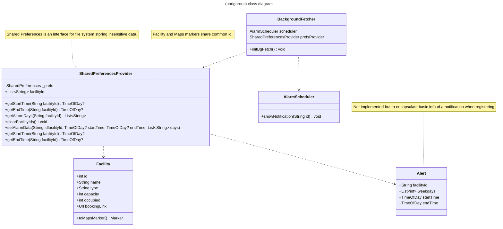

```mermaid
---
title: (unrigorous) class diagram
---
classDiagram
    note "Facility and Maps markers share common id."
    class Facility {
        +int id
        +String name
        +String type
        +int capacity
        +int occupied
        +Url bookingLink

        +toMapsMarker() Marker
    }

    note for Alert "Not implemented but to encapsulate basic info of a notification when registering"
    class Alert {
        +String facilityId
        +List~int~ weekdays
        +TimeOfDay startTime
        +TimeOfDay endTime
    }

    note for SharedPreferencesProvider "Shared Preferences is an interface for file system storing insensitive data."
    class SharedPreferencesProvider {
        -SharedPreferences _prefs
        +List~String~ facilityId
        +getStartTime(String facilityId) TimeOfDay?
        +getEndTime(String facilityId) TimeOfDay?
        +getAlarmDays(String facilityId) List~String~
        +clearFacilityIds() void
        +setAlarmData(String idfacilityId, TimeOfDay? startTime, TimeOfDay? endTime, List~String~ days)
        +getStartTime(String facilityId) TimeOfDay?
        +getEndTime(String facilityId) TimeOfDay?
    }

    class AlarmScheduler {
        +showNotification(String id) void
    }

    class BackgroundFetcher {
        AlarmScheduler scheduler
        SharedPreferencesProvider prefsProvider

        +initBgFetch() void
    }

    SharedPreferencesProvider ..> Alert
    SharedPreferencesProvider ..> Facility
    BackgroundFetcher ..> AlarmScheduler
    BackgroundFetcher ..> SharedPreferencesProvider
```
