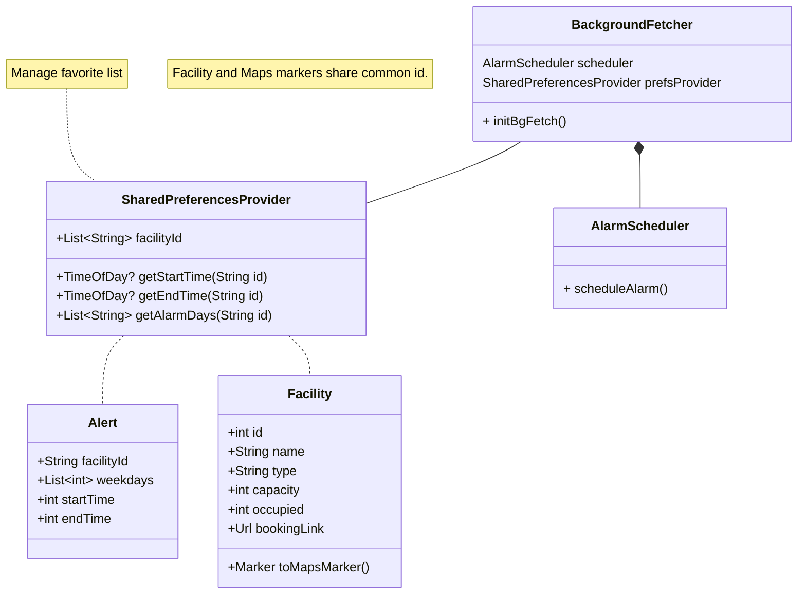

```mermaid
classDiagram
    note "Facility and Maps markers share common id."
    class Facility {
        +int id
        +String name
        +String type
        +int capacity
        +int occupied
        +Url bookingLink

        +Marker toMapsMarker()
    }

    class Alert {
        +String facilityId
        +List~int~ weekdays
        +int startTime
        +int endTime
    }

    note for SharedPreferencesProvider "Manage favorite list"
    class SharedPreferencesProvider {
        +List~String~ facilityId
        +TimeOfDay? getStartTime(String id)
        +TimeOfDay? getEndTime(String id)
        +List~String~ getAlarmDays(String id)
    }

    class AlarmScheduler {
        + scheduleAlarm()
    }

    class BackgroundFetcher {
        AlarmScheduler scheduler
        SharedPreferencesProvider prefsProvider

        + initBgFetch()
    }

    SharedPreferencesProvider .. Alert
    SharedPreferencesProvider .. Facility
    BackgroundFetcher *-- AlarmScheduler
    BackgroundFetcher -- SharedPreferencesProvider
```
