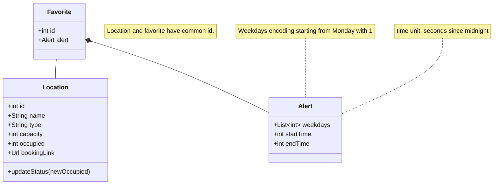

```mermaid
classDiagram
    note "Location and favorite have common id."
    class Location {
        +int id
        +String name
        +String type
        +int capacity
        +int occupied
        +Url bookingLink

        +updateStatus(newOccupied)
    }

    class Favorite {
        +int id
        +Alert alert
    }

    note for Alert "time unit: seconds since midnight"
    note for Alert "Weekdays encoding starting from Monday with 1"
    class Alert {
        +List~int~ weekdays
        +int startTime
        +int endTime
    }

    Favorite -- Location
    Favorite *-- Alert
```
